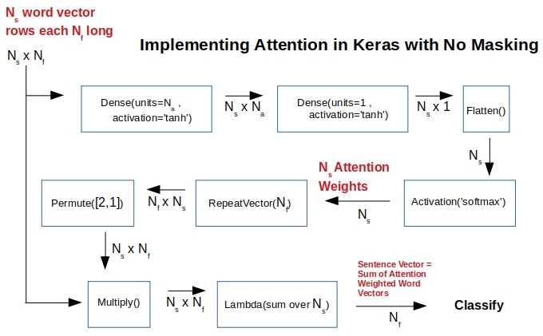
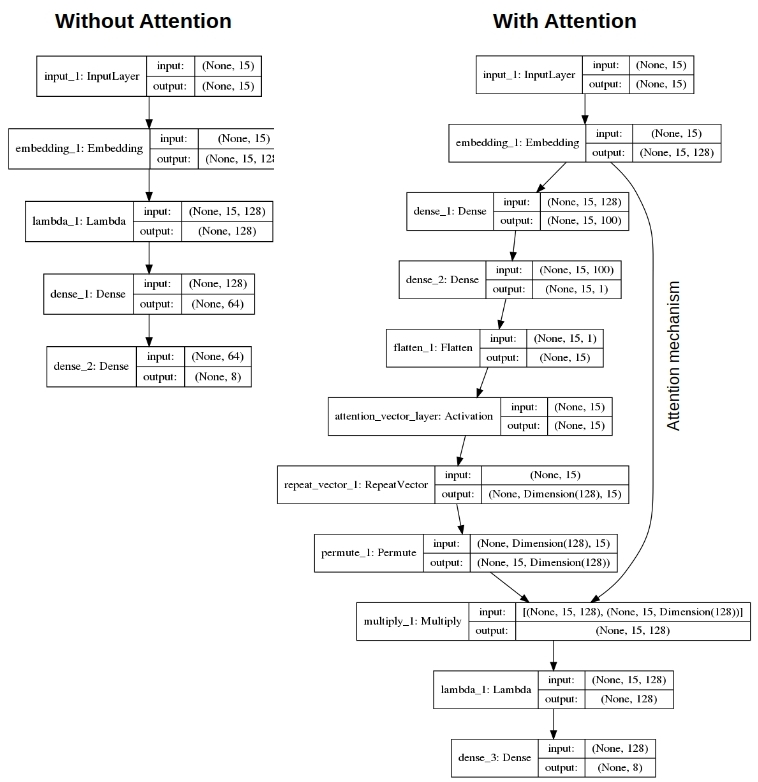
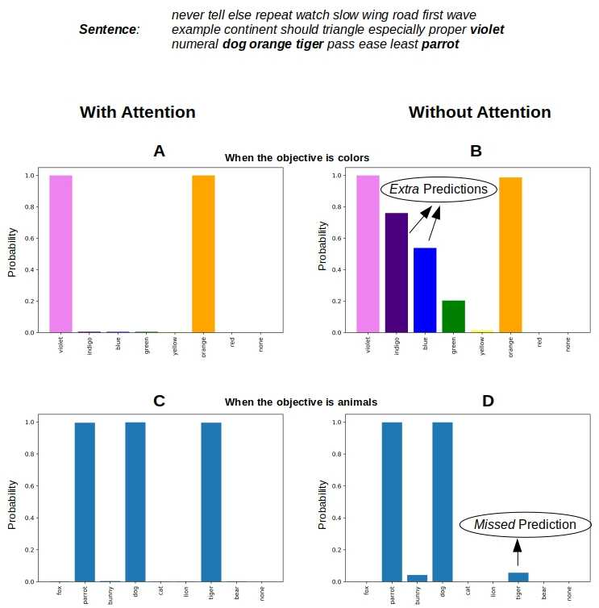

# Attention as Dynamic Tf-Idf for Deep Learning

This is the source code to go along with the blog article

[Attention as Adaptive Tf-Idf for Deep Learning](http://xplordat.com/2019/07/22/attention-as-adaptive-tf-idf-for-deep-learning/)

Bahdanau Attention is applied in the context of a multi-class, multi-label classification of a set of synthetic documents. The purpose is to illustrate the effectiveness of attention and how it dynamically identifies the influential words responsible for the particular classification objective in consideration.

*Figure 1. A Keras implementation of attention with functional API when masking is not used. Takes an array of word-vectors representing a sentence and yields an attention weighted sentence vector that can be used for whatever classification objective. All sentences have the same number (includig the dummy words) of words without masking.*

##	Summary

Attention is like tf-idf for deep learning. Both attention and tf-idf boost the importance of some words over others. But while tf-idf weight vectors are static for a set of documents, the attention weight vectors will adapt depending on the particular classification objective. The attention mechanism derives larger weights for those words that are influencing the classification objective, thus opening a window into decision making blackbox as to why a document has been classified the way it has been…

*Figure 2. Data flow with & without attention, and with & without masking. Attention layer from [Christos Baziotis](https://gist.github.com/cbaziotis/6428df359af27d58078ca5ed9792bd6d) is used when masking is in place.*

## Dependencies

	keras
	tensorflow
	graphviz
	pydot
	numpy
	sklearn

# Usage

##	Generate Data

	mkdir data
	PYTHONHASHSEED=0 ; pipenv run python ./gendata.py

##	Run classification tasks

	mkdir results

	./run.sh no colors		# Classify by color reference without applying attention
	./run.sh no animals		# Classify by animal reference without applying attention
	./run.sh yes colors		# Classify by color reference with attention
	./run.sh yes animals	# Classify by animal reference with attention

##	Plot results

Pick a sentence from the test array to see how we performed for that sentence

	pipenv run python ./plots.py 41 # '41' is the index of the sentence in the list of test sentences

# Sample Results

##	Attention weights obtained for a sentence

*Figure 3. Attention mechanism identifies the right words controlling the classification objective and obtains larger weights for those words. Thus the weights for the same words are different when the classification objective changes. This is unlike tf-idf  weighting that is independent of the NLP task.*

##	Predictions for the same sentence

*Figure 4. The larger weights for the words controlling classification allow for exact classification when attention is in place.. Masking does not make any difference for this simple problem. But without attention the predictions have extra & missing classes.*

